<!-- Language switch nav (top-left) -->

<a id="top"></a>
<p align="left">
  <strong>English</strong> ｜ <a href="./README.zh-CN.md">简体中文</a>
</p>

<div align="center">

# 🔒 async-lock-and-run

**Run async functions under a per-key mutual exclusion lock.**

> Run async functions under mutual exclusion per `lockerId` (key): calls sharing the same lock run serially (FIFO arrival order), while calls using different locks run fully in parallel. Lightweight, zero runtime dependencies, pure JS/TS — works in the browser too.

[](https://www.npmjs.com/package/@rickyli79/async-lock-and-run)
[](https://www.npmjs.com/package/@rickyli79/async-lock-and-run)

</div>

---

## 📑 Table of Contents

- [📖 Introduction](#introduction)
- [✨ Features](#features)
- [📦 Installation](#installation)
- [🚀 Quick Start](#quick-start)
- [🧩 API](#api)
- [⚠️ Semantics & Notes](#semantics--notes)
- [🌐 Browser Support](#browser-support)
- [🛠️ Development](#development)
- [🚢 Release Process](#release-process)
- [📄 License](#license)

---

<a id="introduction"></a>

## 📖 Introduction

`@rickyli79/async-lock-and-run` is a minimal "per-key mutual exclusion" async lock utility. It is built around a single function, `asyncLockAndRun`: you provide a lock identifier `lockerId` and an async function `body`, and it guarantees that **all calls for the same `lockerId` run serially in arrival (FIFO) order, while calls for different `lockerId`s run fully in parallel**.

Typical use cases:

- Concurrency limiting for the same resource (e.g. many requests hitting the same endpoint/key — only one runs at a time).
- Mutually exclusive writes (same-key DB writes, cache updates, token refresh, etc.).
- You just want to "queue" a piece of async code without pulling in a heavyweight task-queue/semaphore library.

It has **zero runtime dependencies** — the implementation is pure JS/TS (no static `node:` imports) — so it works on both **Node.js and the browser**.

<a id="features"></a>

## ✨ Features

- 🔑 **Per-key mutual exclusion**: calls with the same `lockerId` run serially (FIFO arrival order); calls with different `lockerId`s run fully in parallel.
- 🎯 **Independent calls**: every call executes its own `body` and gets its own result — no sharing or cross-talk.
- 🛡️ **Error isolation**: if a `body` rejects, only that single call is rejected; queued sibling calls still run, and the lock is **always released** (guaranteed via `try/finally`), so nothing downstream gets stuck.
- 🆔 **Keys compared by identity**: the number `1` and the string `"1"` are **different locks**, and `symbol`s are unique.
- 🔄 **Reentrancy detection**: on Node.js (≥ 22.3, which supports `process.getBuiltinModule`), re-entering the same `lockerId` from inside its own `body` is detected and **throws** (prevents a deadlock); on runtimes without support (e.g. the browser) it degrades to a plain per-key mutex.
- 🧩 **Pure JS/TS, zero deps**: no static `node:` imports — browser-friendly.
- 📦 **Dual format**: ships both ESM and CJS with full TypeScript types.

<a id="installation"></a>

## 📦 Installation

With pnpm (the project's dev environment requires `pnpm ^11.18.0`):

```bash
pnpm add @rickyli79/async-lock-and-run
```

Or with npm or yarn:

```bash
npm install @rickyli79/async-lock-and-run
# or
yarn add @rickyli79/async-lock-and-run
```

> The package is published to the public npm registry (`https://registry.npmjs.org`) with `publishConfig.access = public`.

### Module formats (ESM + CJS)

The package ships dual builds (generated by tsup). The `exports` map:

| Entry                        | Type declarations  | Notes     |
| ---------------------------- | ------------------ | --------- |
| `import` → `dist/index.js`   | `dist/index.d.ts`  | ESM entry |
| `require` → `dist/index.cjs` | `dist/index.d.cts` | CJS entry |

Package-level config: `type: module`, `main: ./dist/index.cjs`, `module: ./dist/index.js`.

**ESM (recommended)**

```ts
import { asyncLockAndRun } from "@rickyli79/async-lock-and-run";
```

**CJS**

```js
const { asyncLockAndRun } = require("@rickyli79/async-lock-and-run");
```

<a id="quick-start"></a>

## 🚀 Quick Start

### Example 1: concurrency limiting / mutual exclusion

Fire many requests at once, but serialize per resource while different resources run in parallel:

```ts
import { asyncLockAndRun } from "@rickyli79/async-lock-and-run";

// Simulates an expensive/limited operation on a resource
async function fetchRemote(key: string): Promise<string> {
  await new Promise((resolve) => setTimeout(resolve, 100));
  return `data:${key}`;
}

// Same lockerId serializes; different lockerIds run in parallel
function loadOnce(key: string): Promise<string> {
  return asyncLockAndRun({ lockerId: key, body: () => fetchRemote(key) });
}

// 3 concurrent requests for "hot" + 1 for "cold"
const [a, b, c, d] = await Promise.all([
  loadOnce("hot"),
  loadOnce("hot"), // queued: waits for the previous "hot" to finish
  loadOnce("hot"), // queued: waits for the first two "hot" calls to finish
  loadOnce("cold"), // different key: fully parallel with "hot", no queueing
]);

console.log(a, b, c, d);
```

### Example 2: error isolation

A failing call does not affect queued siblings, and the lock is released:

```ts
import { asyncLockAndRun } from "@rickyli79/async-lock-and-run";

const failing = asyncLockAndRun({
  lockerId: "job",
  body: async () => {
    await new Promise((resolve) => setTimeout(resolve, 10));
    throw new Error("boom");
  },
});

const succeeding = asyncLockAndRun({
  lockerId: "job",
  body: async () => {
    await new Promise((resolve) => setTimeout(resolve, 10));
    return "ok";
  },
});

try {
  await failing; // rejects only this single call
} catch (error) {
  console.error("This call failed:", (error as Error).message); // boom
}

console.log(await succeeding); // "ok" — the queued sibling still runs
```

<a id="api"></a>

## 🧩 API

The package's core (and only) export is the async function `asyncLockAndRun`.

### Signature

```ts
async function asyncLockAndRun<T = void>(arg: AsyncLockAndRun<T>): Promise<T>;
```

### Parameters

`arg` is an object with two fields:

| Parameter      | Type                         | Required | Description                                                                                                                                                                              |
| -------------- | ---------------------------- | -------- | ---------------------------------------------------------------------------------------------------------------------------------------------------------------------------------------- |
| `arg.lockerId` | `string \| number \| symbol` | yes      | Lock identifier. Calls with the same `lockerId` are mutually exclusive (FIFO); different `lockerId`s run fully in parallel. Compared by **identity**: `1` and `"1"` are different locks. |
| `arg.body`     | `() => Promise<T>`           | yes      | The async function to run under the lock; its return value is this call's result.                                                                                                        |

### Return value

`Promise<T>`:

- On success, resolves to `body`'s return value (`T`).
- If `body` throws/rejects, it rejects with the same reason — **affecting only this call**; queued siblings are unaffected and the lock is always released.
- On Node.js, a **reentrant call** (see "Semantics & Notes" below) rejects with an `Error`.

### Type definitions

```ts
export type AsyncLockAndRun<T> = {
  lockerId: string | number | symbol;
  body: () => Promise<T>;
};

export async function asyncLockAndRun<T = void>(
  arg: AsyncLockAndRun<T>,
): Promise<T>;
```

<a id="semantics--notes"></a>

## ⚠️ Semantics & Notes

1. **Per-`lockerId` mutual exclusion (FIFO)**: calls for the same `lockerId` queue strictly in arrival order, one at a time; calls for different `lockerId`s never block each other and run fully in parallel.
2. **Independent calls**: every call runs its own `body` and gets its own result — results are never shared or reused across calls.
3. **Error isolation**: a rejected `body` only rejects that single call; queued siblings still run, and the lock is always released (guaranteed by `try/finally` internally).
4. **Keys compared by identity**: the number `1` and the string `"1"` are **different** locks, and `symbol`s are unique. Make sure callers pass a consistent `lockerId` type, or you'll get locks that "look the same but aren't".
5. **Reentrancy detection (Node.js ≥ 22.3)**: re-entering `asyncLockAndRun` with the **same `lockerId`** from inside its own `body` would deadlock, so Node.js detects it and throws (`reentrant call ... would deadlock`). If you need to do nested async work under a lock, use a **different `lockerId`**.
6. **Runtimes without detection**: on runtimes without `async_hooks` (e.g. the browser), reentrancy detection is disabled and behavior degrades to a plain per-key mutex — re-entering the same `lockerId` from inside its own `body` **will deadlock**. Avoid reentrancy.

<a id="browser-support"></a>

## 🌐 Browser Support

The implementation is pure JS/TS with **no static `node:` dependencies** (`node:async_hooks` is loaded dynamically, on demand, only on runtimes that support `process.getBuiltinModule`), so it works directly in browsers / bundlers (Vite, Webpack, etc.).

Differences to be aware of:

- Browsers have no `async_hooks` equivalent, so **reentrancy detection is disabled**.
- Therefore, in the browser, re-entering the same `lockerId` from inside its own `body` **deadlocks directly** — avoid that pattern (use a different `lockerId` or restructure).

<a id="development"></a>

## 🛠️ Development

### Requirements

- Node.js (≥ 22.3 to exercise the reentrancy-detection path locally)
- pnpm `^11.18.0` (`devEngines.packageManager`; prompts a download if not satisfied)

### Scripts

| Command                      | Description                                                                             |
| ---------------------------- | --------------------------------------------------------------------------------------- |
| `pnpm run typecheck`         | Type check (`tsc --noEmit`)                                                             |
| `pnpm test`                  | Run tests (`vitest run`, currently **9** tests)                                         |
| `pnpm run build`             | Build (`tsup` → ESM + CJS + d.ts / d.cts)                                               |
| `pnpm run changelog`         | Generate `CHANGELOG.md` (`auto-changelog`, keepachangelog template, starting at v0.1.0) |
| `pnpm run changelog:preview` | Generate preview `CHANGELOG-preview.md`                                                 |

### Project structure

```
async-lock-and-run/
├── src/
│   ├── index.ts          # Core implementation (asyncLockAndRun + reentrancy detection)
│   └── index.test.ts     # vitest tests (9 cases)
├── tsup.config.ts        # Dual-format build config (ESM + CJS + dts)
├── vitest.config.ts      # Test config
├── tsconfig.json         # TypeScript config
├── .github/workflows/    # CI / auto-publish (publish.yml)
└── package.json
```

<a id="release-process"></a>

## 🚢 Release Process

This project follows a **dev (development) → main (release)** two-branch model.

### Manual release steps

1. Bump the version and push to `dev`:

   ```bash
   npm version patch   # or minor / major
   git push origin dev
   ```

2. Open a `dev → main` Pull Request and merge it **with a merge commit (not squash/rebase)**.

3. Merging into `main` triggers the automated release pipeline.

### Automated release pipeline

On `push main`, GitHub Actions (`.github/workflows/publish.yml`) runs automatically:

```mermaid
flowchart LR
    A["dev branch"] -->|"npm version patch / minor / major"| B["Bump version"]
    B -->|"push dev"| C["PR dev → main (merge commit)"]
    C -->|"push main"| D["GitHub Actions publish.yml"]
    D --> E["Version gate"]
    E --> F["typecheck / test / build"]
    F --> G["pnpm publish (OIDC Trusted Publishing + provenance)"]
    G --> H["Auto-create vX.Y.Z tag"]
    H --> I["Generate changelog / create GitHub Release"]
    I --> J["Commit CHANGELOG.md back to main"]
```



Key points:

- Publishing uses **OIDC Trusted Publishing + provenance** — no npm token stored in CI.
- On success it **auto-creates the `vX.Y.Z` tag**, generates the changelog, creates the GitHub Release, and commits `CHANGELOG.md` back to `main`.
- Publishing is skipped if the version gate or any of typecheck / test / build fails.

<a id="license"></a>

## 📄 License

[MIT](./LICENSE) © [Ricky Li](mailto:382688672@qq.com)
